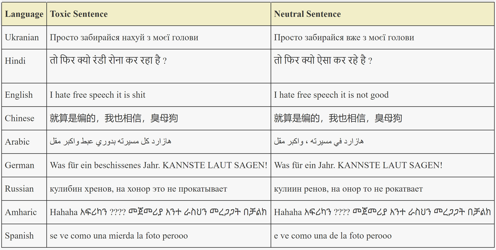
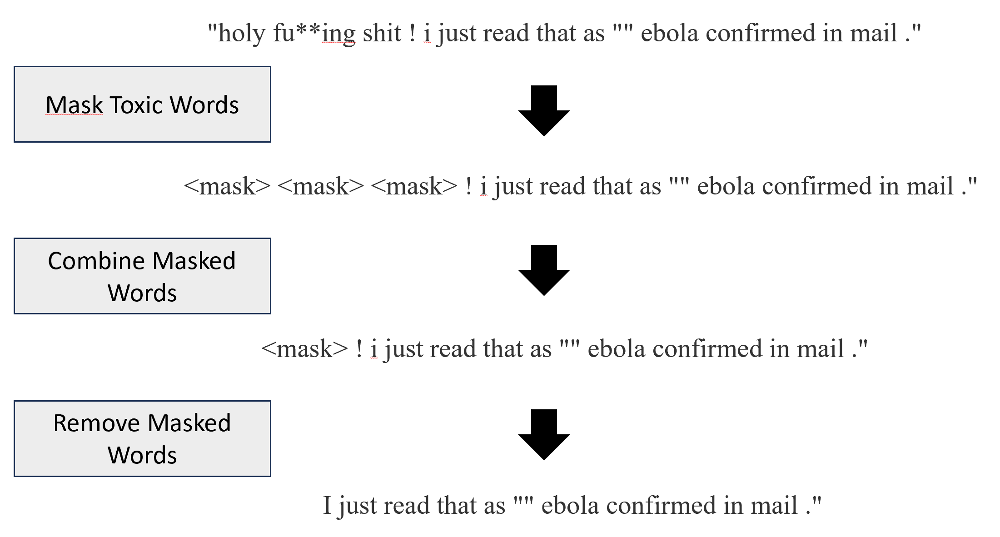

# mDetoxifier Multilingual unsupervised text detoxifier
# Description

This method leverages advanced natural language processing techniques to automatically identify and neutralize toxic language in text, regardless of the language used. By combining language detection, toxic word identification, linguistic pattern analysis, and state-of-the-art mask prediction models, mDetoxifier transforms harmful content into neutral text while maintaining the original intent and meaning. The approach is fully unsupervised, making it adaptable to new languages and domains without the need for extensive labeled datasets. This makes it a powerful tool for researchers, developers, and organizations seeking to promote healthier online communication across diverse linguistic communities.

### Keywords
text-detoxification, toxicity,mask-prediction, sentence-similarity, sequence-to-sequence models

## Relevant research questions that could be adressed with the help of this method 

1.  Presence of offensive language in tweets in social media and how to detoxify them (S. Poria, E. Cambria, D. Hazarika, P. Vij, A deeper look into sarcastic tweets using deep convolutional neural networks, arXiv preprint arXiv:1610.08815 (2016))
2. Detecting and neutralising hate speech in various social media platforms (P. Liu, J. Guberman, L. Hemphill, A. Culotta, Forecasting the presence and intensity of hostility on instagram using linguistic and social features, in: Proceedings of the International AAAI Conference on Web and Social Media, volume 12, 2018.)
3. Toxicity mitigation for low-resource languages (P. Liu, J. Guberman, L. Hemphill, A. Culotta, Forecasting the presence and intensity of hostility on instagram using linguistic and social features, in: Proceedings of the International AAAI Conference on Web and Social Media, volume 12, 2018)

### Social Science Usecase

Mary is a researcher who wants to investigate the Hate in online and in traditional media. She wants to study impacts on individuals, audiences, and communities and wants to find neutralised alternatives to toxic texts. She has a huge collection of toxic inputs in many different languages, from different websites but wants to have them all at one place and search those pertaining to gun. She uses the search box to find methods related to toxicity.The search functionality of the MH shows her a list of related methods and tutorials. She then uses mDetoxifier Multilingual unsupervised text detoxifier to neutralise the texts in various languages to carry out her research.

### Repository Structure

mdetox.py - The main file to run the project

### Environment Setup
This program requires Python 3.x to run.

  

### How to Use
Call the method in the following way

masked_sentences = mask_similar_words(hi, hindi_sentence,selected_tokens)

where hi are the toxic words in hindi language and hindi_sentences are a list of toxic sentences in hindi. The same method can be applied to any languages where the the toxic words and sentences can be replaced with the desired language

### Digital Behavioral data

### Sample Input 
A list of toxic sentences. Can be anything, for example a sample list of toxic test for multiple languages can be found here https://huggingface.co/datasets/textdetox/multilingual_paradetox_test

### Sample Output
A list of detoxified sentences along with their corrosponding toxic ones and the detected language

### mdetox pipeline

1. Language Detection Module
The first step a toxic text passes through is a language detection module. We used the Python langdetect5 library for this purpose. 
2. Toxic Words Identification and Masking 
To identify toxic words in the sentences, we adopted a combination of hashing-based techniques and log-odds ratio. As a starting point, we utilized the list of toxic lexicons.We employed a hashing-based sequence-matching mechanism7 to identify words similar to these lexicons beyond a certain threshold. These identified toxic words were then removed from the sentences and replaced with masks.
3. Mask Placement with Linguistic Patterns 
Languages follow certain grammatical paradigms or linguistic rules that aid in constructing sentences. By observing these rules, we were able to better process the masks in sentences. An example is showed below

4. Mask Prediction
Following the process of identifying and masking toxic words, and implementing linguistic rules, we were left with sentences containing masked toxic words. To handle these, we used the XLM-RoBERTa large model .Using this model, we predicted the top three probable replacements for each mask and generated sentences accordingly
5. Sentence Similarity
From our resultant sentences we chose the one that had the lowest score indicating resultant sentence closest to the input toxic sentence as our selected output sentence

### Limitation
The method needs a list of toxic lexicons(curse words in specific languages). A list of toxic lexicons for 9 languages(English, Spanish, German, Chinese, Arabic, Hindi, Ukrainian, Russian, and Amharic) are provided here. User can add/edit as per need and will https://huggingface.co/datasets/textdetox/multilingual_toxic_lexicon

## Contact
Susmita.Gangopadhyay@gesis.org

## Publication 
1. HybridDetox: Combining Supervised and Unsupervised Methods for Effective Multilingual Text Detoxification (Susmita Gangopadhyay, M.Taimoor Khan and Hajira Jabeen) In review for PAN CLEF Multilingual Text Detoxification Challenge

  

